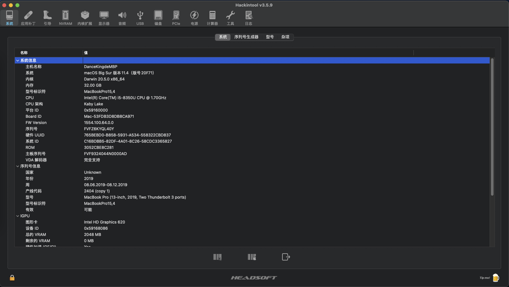
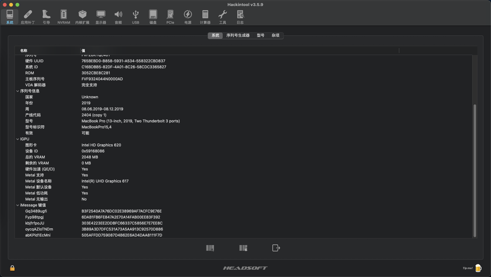
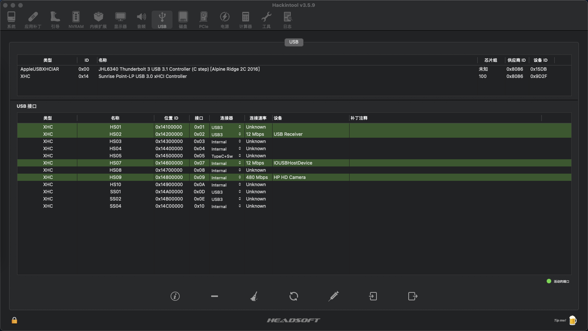
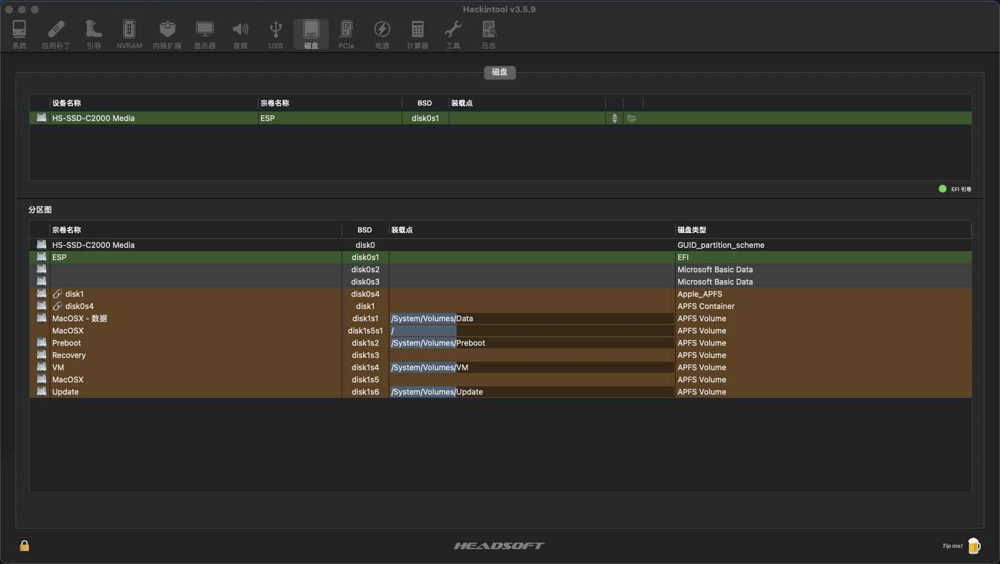
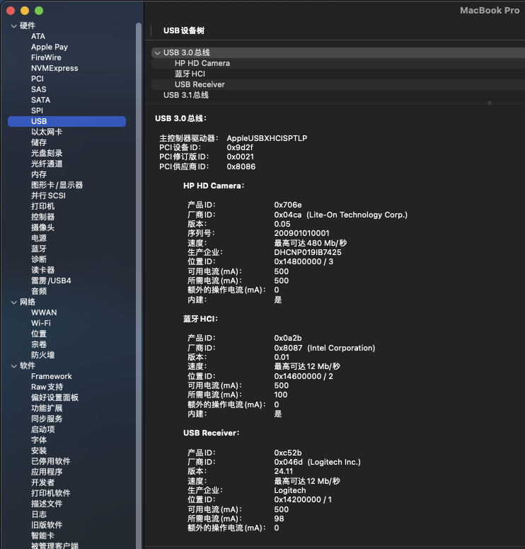
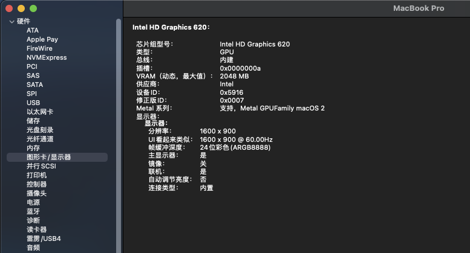
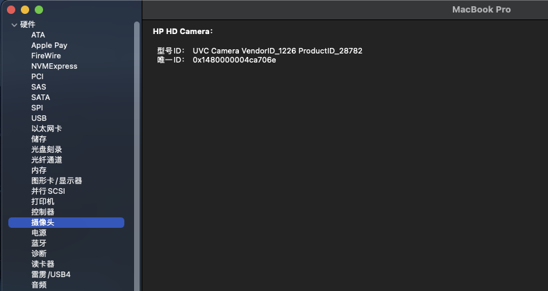
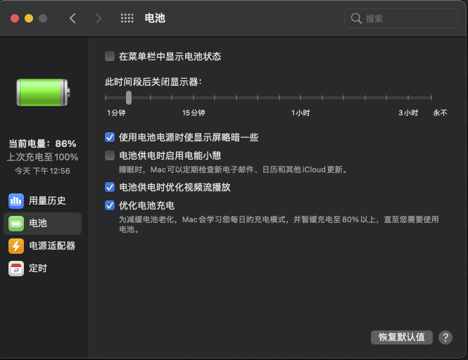
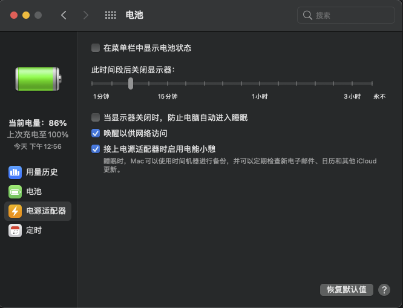
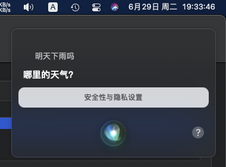

[English](./README.md)
#### 我的配置:
- Intel Core i5-8350U
- Intel UHD 620 集显
- 32 GB DDR4 (2x 16GB) 内存
- 全高清无触摸显示器 (1920x1080)
- UVC Camera VendorID_1226 ProductID_28782 摄像头
- 无光线感应器
- 海康威视 C2000Pro 512GB M.2 SSD NVMe
- Intel WiFi AC8260 无线网卡

#### BIOS设置:
- 设置:Video Memory size set to 64 MB 
- 关闭:TPM、Intel TXT、Virtualization Technology for Directed I/O (VTd)、LAN/WLAN auto switching 
- 打开:Intel Management Enginge (ME) in "Advanced -> Remote Management Options"

#### ⚠️⚠️⚠️
- 不要使用DW1820A无线网卡，否则各种奇怪错误，比如死机、无法安装系统、无法进系统等等。

#### 截图:

