[中文](./README-zh_CN.md)
#### My configuration:
- Intel Core i5-8350U
- Intel UHD 620
- 32 GB DDR4 (2x 16GB)
- Full HD non-touch display (1920x1080)
- UVC Camera VendorID_1226 ProductID_28782
- No ambient light sensor
- HIKVISION C2000Pro 512GB M.2 SSD NVMe
- Intel WiFi AC8260

#### BIOS:
- Set:Video Memory size set to 64 MB
- Disable :TPM、Intel TXT、Virtualization Technology for Directed I/O (VTd)、LAN/WLAN auto switching 
- Enable:Intel Management Enginge (ME) in "Advanced -> Remote Management Options"

#### Works:
- Speakers
- Headphones output
- Trackpad with gestures
- USB 3 Ports
- USB-C (Can use TypeC-DP to monitor 2K)
- HP Webcam
- LAN/Ethernet
- Fn keys to change volume or brightness
- Battery percentage/status
- Sleep/Wake-up
- HDMI Out
- Bluetooth
- WiFi

#### Doesn't Work
- Joystick Mouse
- Smart Card Reader

#### ⚠️⚠️⚠️
- Do not use DW1820A, it will cause problems such as failure to install the system normally or inaccessibility of the system.

#### Screenshots:
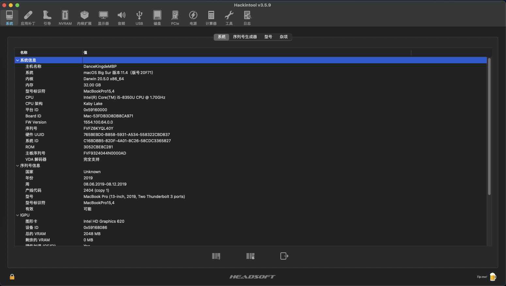
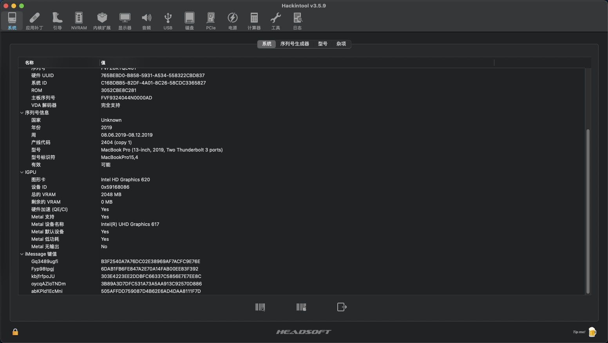
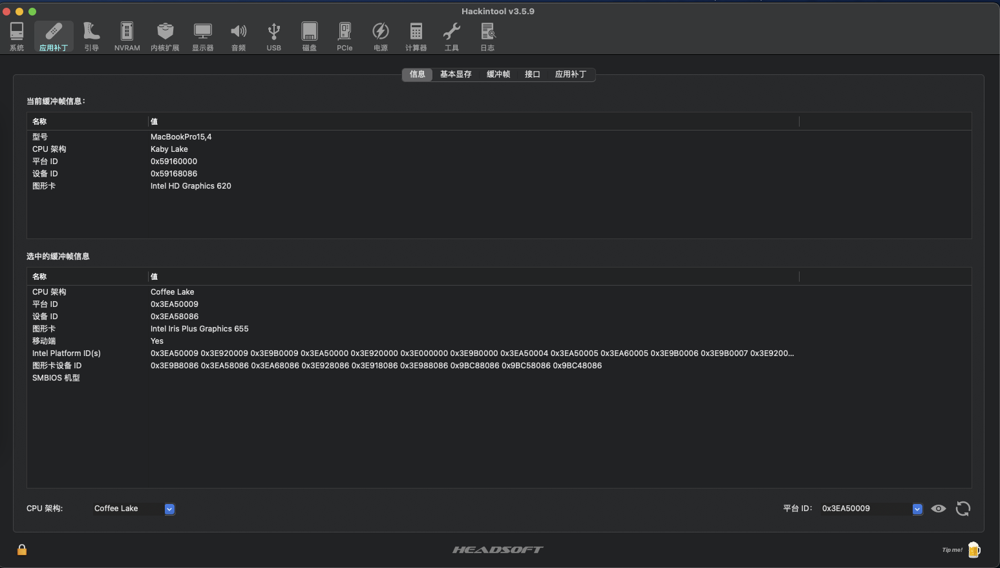
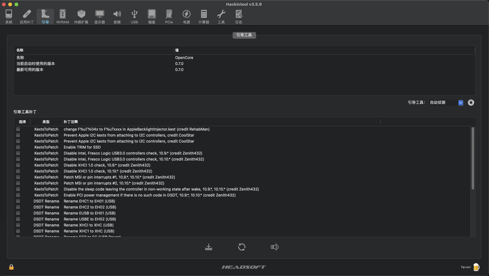
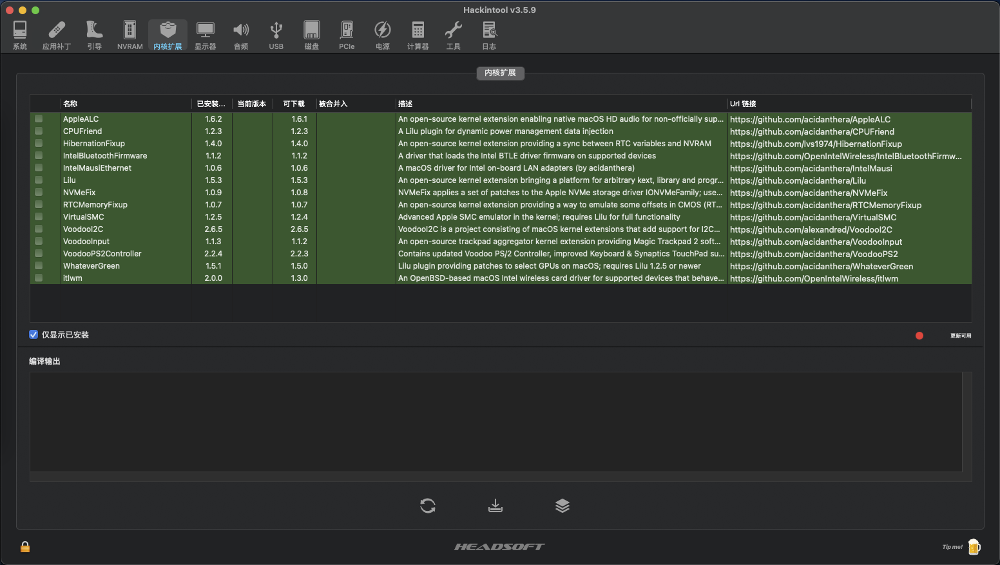
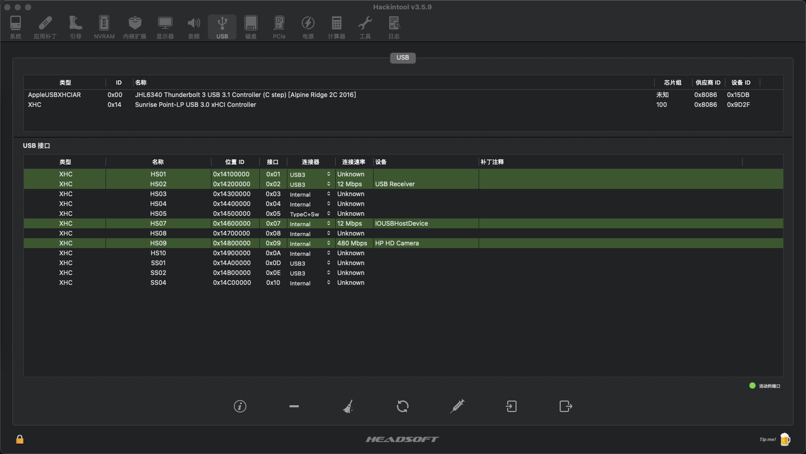
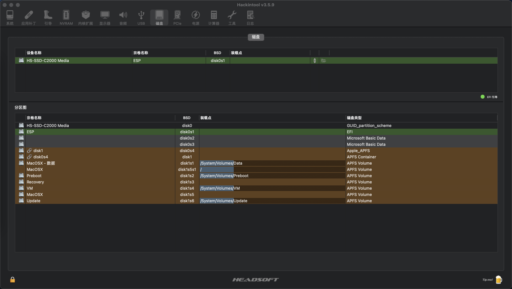
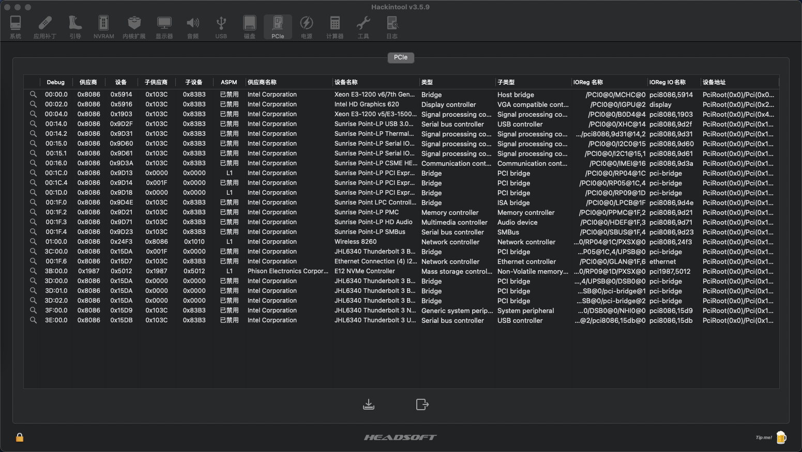
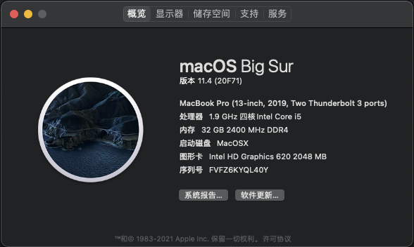
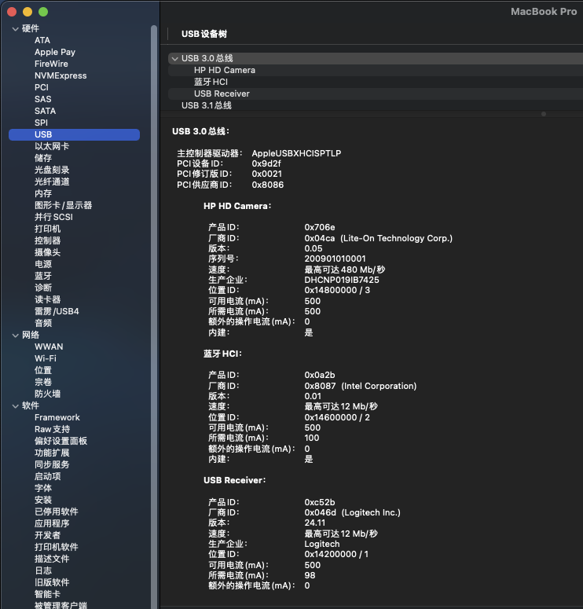
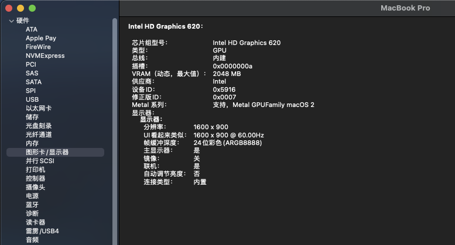
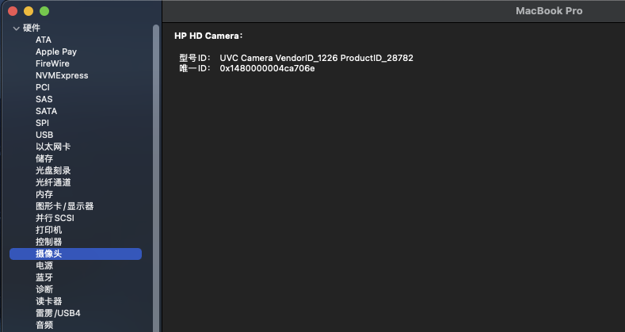
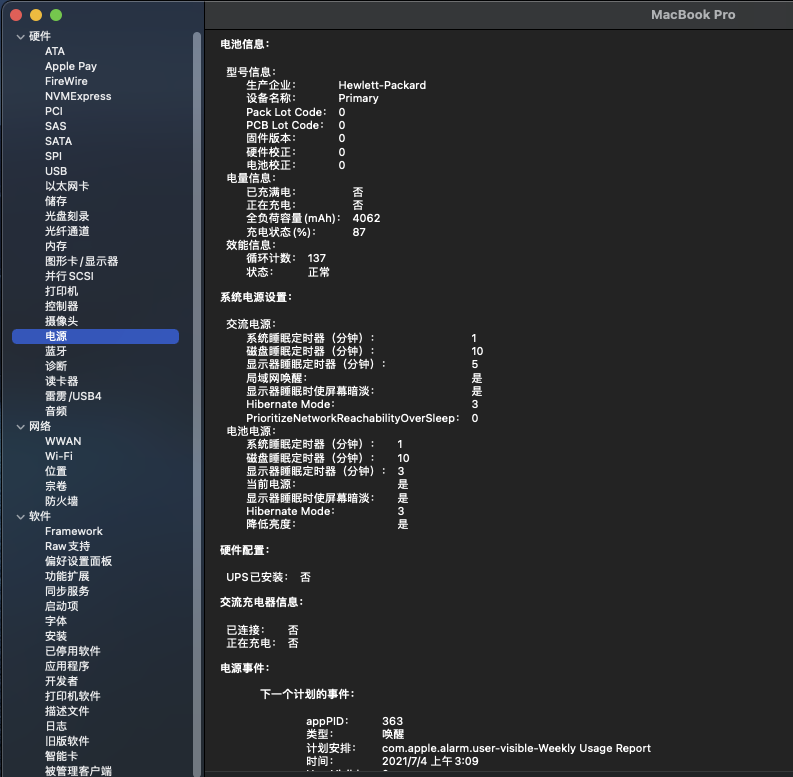
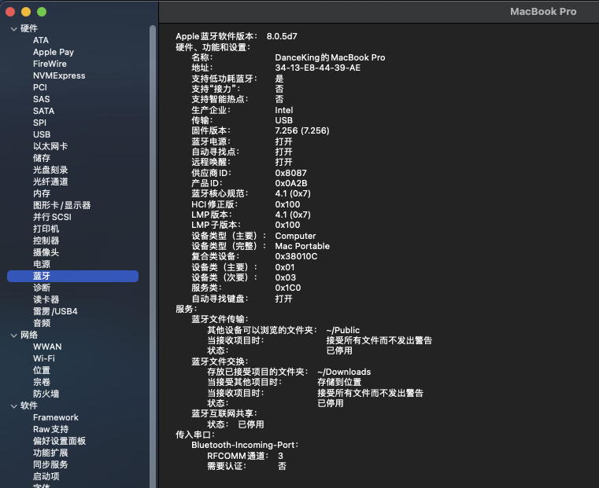
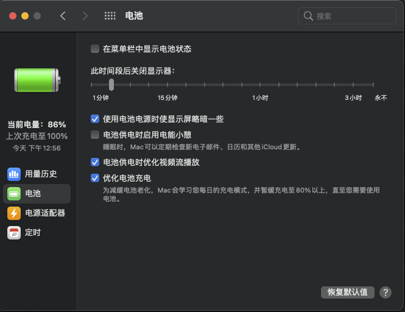
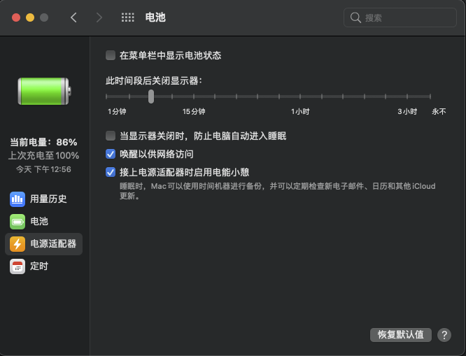
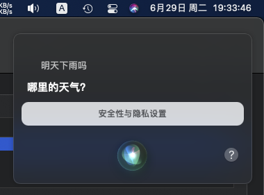

#### Thanks for every hackintosher
